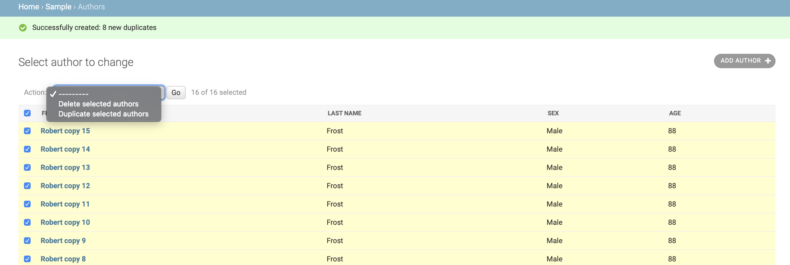

[](https://circleci.com/gh/jackton1/django-clone)
[](https://pypi.org/project/django-clone)
[](https://github.com/jackton1/django-clone/blob/master/LICENSE)
[](https://docs.djangoproject.com/en/2.2/releases/)
## django-clone 

Creating copies of a model instance on the fly offering more control on how the object should be cloned with support for limiting the fields or related objects copied. 

#### Using class attributes
```text
_clonable_model_fields: Restrict the list of fields to copy from the instance.
_clonable_many_to_many_fields: Restricted Many to many fields (i.e Test.tags).
_clonable_many_to_one_or_one_to_many_fields: Restricted Many to One/One to Many fields.
_clonable_one_to_one_fields: Restricted One to One fields.
```

> NB: Ensure that required fields skipped from being cloned are passed in using the `attrs` dictionary.


### Installation

```bash
pip install django-clone
```

Add `model_clone` to your INSTALLED_APPS

```
INSTALLED_APPS = [
    ...
    'model_clone',
    ...
]
```


### Usage

```python
from django.db import models
from django.utils.translation import gettext_lazy as _
from model_clone import CloneMixin

class Tags(models.Model):
    name = models.CharField(max_length=255)
    
    def __str__(self):
        return _(self.name)


class TestModel(CloneMixin, models.Model):
    title = models.CharField(max_length=200)
    tags =  models.ManyToManyField(Tags)

    _clonable_many_to_many_fields = ['tags']
```


#### Creating a clone

```python
In [1]: test_obj = TestModel.objects.create(title='New')

In [2]: test_obj.tags.create(name='men')

In [3]: test_obj.tags.create(name='women')

In [4]: clone = test_obj.make_clone(attrs={'title': 'Updated title'})

In [5]: test_obj.pk
Out[5]: 1

In [6]: test_obj.title
Out[6]: 'New'

In [7]: test_obj.tags.all()
Out[7]: <QuerySet [<Tag: men>, <Tag: women>]>

In [8]: clone.pk
Out[8]: 2

In [9]: clone.title
Out[9]: 'Updated title'

In [10]: clone.tags.all()
Out[10]: <QuerySet [<Tag: men>, <Tag: women>]>
```


#### Duplicate Django-Model from Django-Admin

Change
 
```python
from django.contrib import admin
from django.contrib.admin import ModelAdmin

@admin.register(TestModel)
class ModelToCloneAdmin(ModelAdmin):
    pass
```

to

```python
from model_clone import ClonableModelAdmin

@admin.register(TestModel)
class ModelToCloneAdmin(ClonableModelAdmin):
    pass
```

#### List View


#### Change View


##### SETTINGS
> include_duplicate_action: Enables/Disables the Duplicate action in the List view (Defaults to True)
> include_duplicate_object_link: Enables/Disables the Duplicate action in the Change view (Defaults to 
True)


> NOTE: To include the duplicate button on the change view ensure that `model_clone` is placed before 
`django.contrib.admin`
```python
INSTALLED_APPS = [
    'model_clone',
    'django.contrib.admin',
    '...',
]
```
